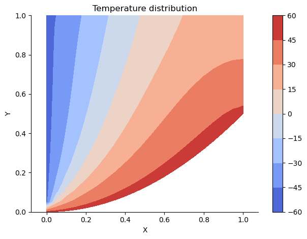

# Solving 2D Heat Equation with Finite Element Method

This repository contains a Finite Elements solver for 2D Heat Equation.

## How to run
This code can be run with:

`python src/heat2d.py`

One can change the number of elements in x and y directions, or the value of boundary conditions with:

```
python src/heat2d.py --num_elm_x 20 --num_elm_y 20 --T0_bottom 50 --T0_left -50 --heat_source 400 --flux_top 100 --grid
```

`--num_elm_x`: number of element in x direction

`--num_elm_y`: number of element in y direction

`--T0_bottom`: prescribed temperature on the bottom edge

`--T0_left`: prescribed temperature on the left edge

`--heat_source`: Magnitude of the source in the domain

`--flux_top`: heat flux on the top boundary

`--grid`: plotting the grid if the user specifies

The output of the above command contains the solution array which is the `Temperature` of all nodes in the discrete domain and a contour plot created illustrating the temperature distribution. The created plots for the shown command, with and without grid, is as following.

**Temperature distribution with the grid:**
<center></center>  

**Temperature distribution without the grid:**
<center></center>
